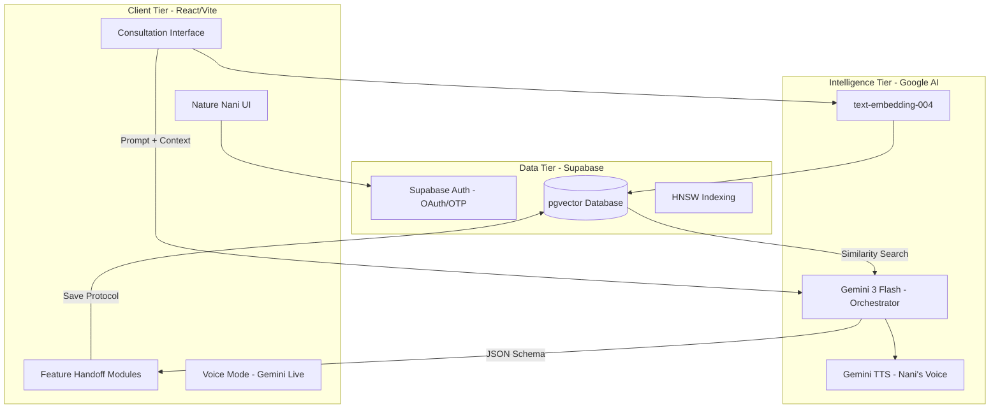
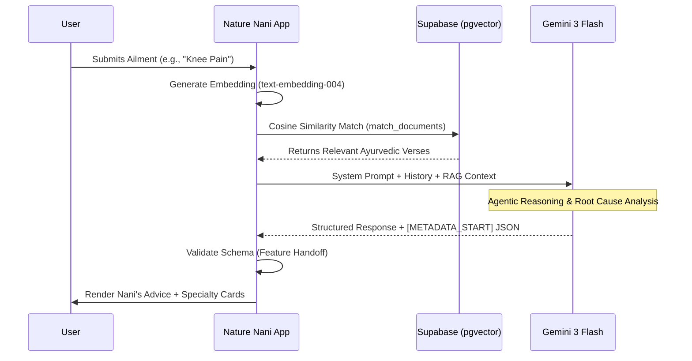
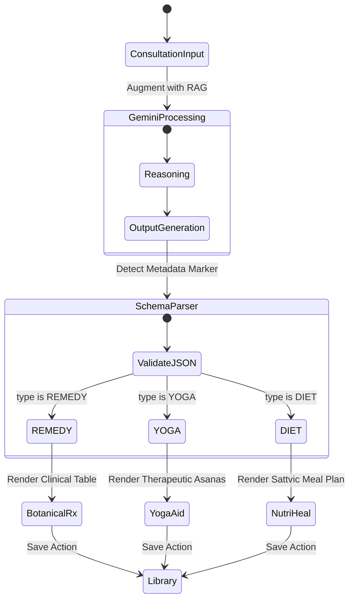

# Nature Nani: Multi-Agent RAG Orchestration Engine

Nature Nani is a production-grade Generative AI platform that leverages **Google Gemini 3 Flash** and a high-performance **pgvector** backend. The system is designed for sub-250ms query latency using an asynchronous data orchestration layer and a proprietary "Feature Handoff" agentic logic.

## 🏗 System Architecture

The platform is built on a "Grounding-First" philosophy, ensuring that every LLM response is anchored in verified vector embeddings from ancient Ayurvedic and Naturopathic scriptures.

## 🛠 Technical Deep Dive: pgvector Implementation

For our vector search, we moved beyond basic semantic search to focus on precision at scale.

### 1. Indexing Strategy: HNSW
To maintain sub-250ms latency as the dataset scales, we implemented **HNSW (Hierarchical Navigable Small World)** indexing on our Supabase instance.

### 2. The RAG Sequence
Every consultation follows a strict grounding sequence to prevent hallucinations.

### 3. The "Feature Handoff" Logic
Nature Nani uses structured **Agentic Handoff** to transition from general consultation to specialized healing modules.

## 🥗 Nutri-Heal Philosophy
The engine is strictly configured for **Sattvic Nutrition**:
*   **Ayurvedic Purity:** Focus on light, life-promoting foods.
*   **Strict Restrictions:** Zero red meat or poultry; specialized legumes and whole grains only.

## 🚀 Performance Benchmarks
*   **Average Query Latency:** <240ms (End-to-End)
*   **Embedding Dimension:** 768 (Optimized for Gemini `text-embedding-004`)

---
*Disclaimer: Nature Nani is an AI-powered educational tool and not a substitute for professional medical advice.*